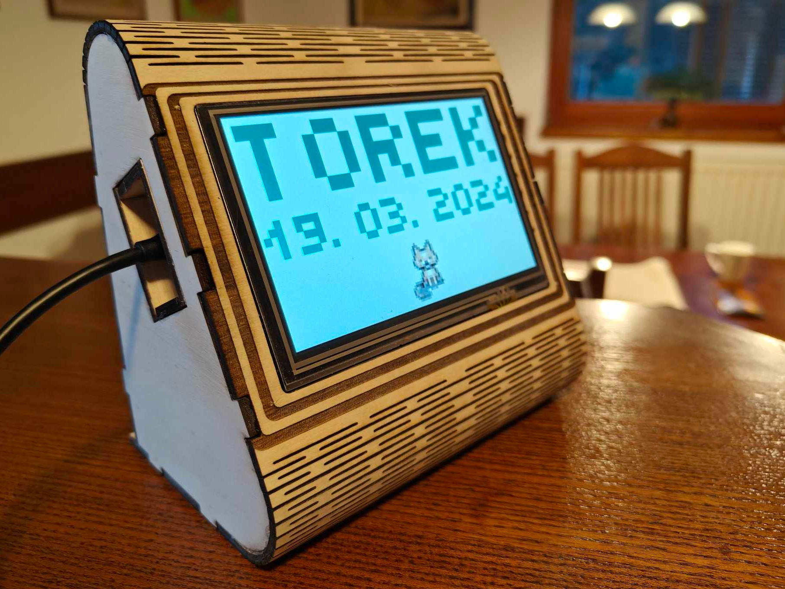
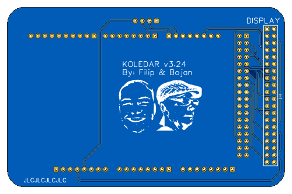
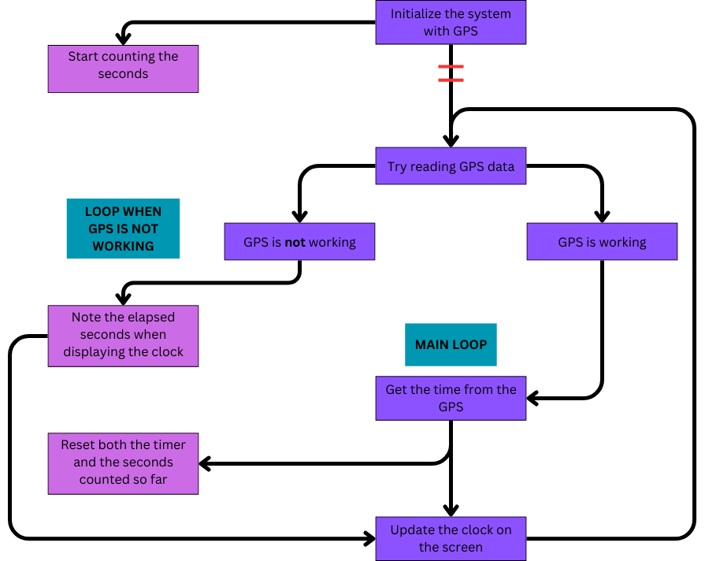

# Koledar 4.24   _The customizable birthday calendar_

 

---

This is my attempt at making a simple calendar for the elderly. It displays the date, time, and up to three birthdays at a time. It was made with the intention that a caretaker would input up to 146 birthdays to the Koledar hardware with the Koledar GUI and take the device to the person's home, where it just needs to be powered next to a window.
  The device uses GPS to read the date and time which makes it completely autonomous.
  The project was made to help my grandma stay as independent as possible by helping her with attending appointments, watching TV shows, and remembering birthdays. It took some getting used to but she says that it is helpful.
  The project started as an extra assignment in the first year of my bachelor's degree in electrical engineering, and it has now been updated two times.

## The creation of the project

### Hardware

The only thing I designed myself was the connector PCB. It neatly fits into the casing and connects the GPS module, display, and Arduino.

 

I used the [NEO-6M GPS module](https://randomnerdtutorials.com/guide-to-neo-6m-gps-module-with-arduino/) for connectivity because it is very well supported on Arduino. The screen is a [5'' touch screen from DIY more](https://www.diymore.cc/products/5-0-800x480-tft-lcd-module-display-touch-panel-ssd1963-for-51-avr-stm32/) with a resolution of 800x480px. I know which library to use with it since I have used it in the previous version and I didn't have any problems with it, so I just used it again. [This](http://rinkydinkelectronics.com/library.php?id=51) is the LCD library. I used a knockoff [Arduino MEGA 2560](https://store.arduino.cc/en-si/products/arduino-mega-2560-rev3?srsltid=AfmBOopCFWO4uVFIkQQ2IXemMtiKCIKrwHhKWaTtJ1ZzTIYdNrtdq98T) board. I didn't put a lot of thought into the board selection. I used an Arduino for all of the previous versions and since the only necessity was enough pins to drive the display and communicate with the GPS module, and the MCU didn't have to be fast or feature-rich, I stuck with the Arduino. For the next iteration, I will consider other platforms.
  Altogether the hardware for the latest version costs approx. 70€, and it was all bought from AliExpress.

### Case

The wooden case was made by my [dad](https://www.instagram.com/bybojci/). He used a laser cutter and thin pieces of wood to complete the construction. Since we only made a couple of these systems we made sure that the final product looked and felt pleasing.

### Firmware

I wrote all of the firmware excluding the LCD and GPS libraries and the code in the "byDay_of_week" function. That code was taken from the internet in my first year but I can't find the source.
  The emphasis when writing the FW was readability and maintainability. I decided to try to use a version of the Hungarian notation, commented all of the code in Doxy style, and used it to generate the documentation. I found the style pleasant but unnecessary at times. I feel like the Doxygen-generated documentation will be useful when coming back to the project at a later time.

  The FW needs to handle getting the time and date from GPS and displaying the appropriate data. When the GUI connects to the HW over USB it also needs to handle the communication, writing, and reading from the EEPROM. In the case that the GPS signal is lost the system displays small text in the bottom left corner indicating that the date and time functionality is being powered from the internal Arduino clock. This is not ideal as the timer is not accurate at all, but for a short time while the GPS signal is not available it's fine.
  The screen used to go black during the night but it was still somewhat bright because of the backlight. I scratched the trace used for powering the LCD backlight in half and sodered a transistor I had in between the connections. I used a free Arduino PWM-enabled GPIO to drive the LCD brightness which enabled me to completely turn it off or dim it.
  The fonts from the [LCD library](http://rinkydinkelectronics.com/library.php?id=51) didn't work well for me so I decided to make my own. I made a simple website that enabled me to draw the letters in a 10 by 12 grid and copy the unsigned integer array to put into a header file. This way I could quickly iterate over different designs and add Slovenian characters that aren't in the English alphabet.

## GUI

I wanted anyone to be able to set up the Koledar so I made the Koledar GUI. It is a Windows application written in Python using Tkinter. Its main functionality is to enable the user to read and write birthdays to the system, but it can also change the text and background color and change the default brightness of the screen.
  The improvement from the previous version was focused on the user experience. I added an alert box when the user attempts to delete the birthdays and the theme profile. I also changed the button layout in a way that makes more sense.

## Known issues

- With certain combinations of colors and brightness the screen starts displaying an effect similar to when a screen is recorded and the shutters aren't in sync.
- The upload of all 146 birthdays takes approx. 15 seconds. At this time the Koledar GUI is unresponsive.
- The user is unable to write the letter 'č' in the Koledar GUI, so they have to copy it from another editor and paste it in.
- Birthdays with names longer than ~19 characters (depending on the birthday date) are very small on the display.

## Future Improvements

The main feature I would change is the way in which the system tracks the time. I initially chose GPS when the system didn't have the ability to store and display birthdays because I wanted it to be plug-and-play. Meaning that I just brought it to where I wanted it (and near a window) and powered it. It also meant that anytime the system was reset it didn't need any input from the user.
  For future versions I would use an accurate RTC IC with a coin battery backup, like [this](https://eu.mouser.com/ProductDetail/NXP-Semiconductors/PCF2131TFY?qs=QNEnbhJQKvbnVL67jlWDOg%3D%3D). Since the user needs to upload the birthdays the system needs to be connected to a PC at least once, where it could read the date and time or let the user input their own. These systems also take care of the calendar logic. This would have the advantage of not having to place the Koledar next to a window, and once it was in sync it wouldn't have to wait for any signal if it was reset.
  I could also make use of the longwave time signal stations like [DCF77](https://en.wikipedia.org/wiki/DCF77). This could be used for a separate system that doesn't need the birthday functionality so it would never get connected to a PC to set the time.

  Another interesting thing to change would be the MCU. In this context, I think there is nothing wrong with using an Arduino, but using something like an ESP32 devkit or a custom PCB could be interesting for the connectivity. I'm just not sure what I would use it for... yet!

  The screen was the most expensive part of the build and I think I can do the build for cheaper. It's nice that it is a touch-capable display so that when the screen is turned off you can briefly turn it on when you touch it, but I could also add a small button to the case for that, and maybe other controls as well. It might also make for a good tactile addition.

  I might do an E-INK, battery-powered, cordless Koledar at some point too.
